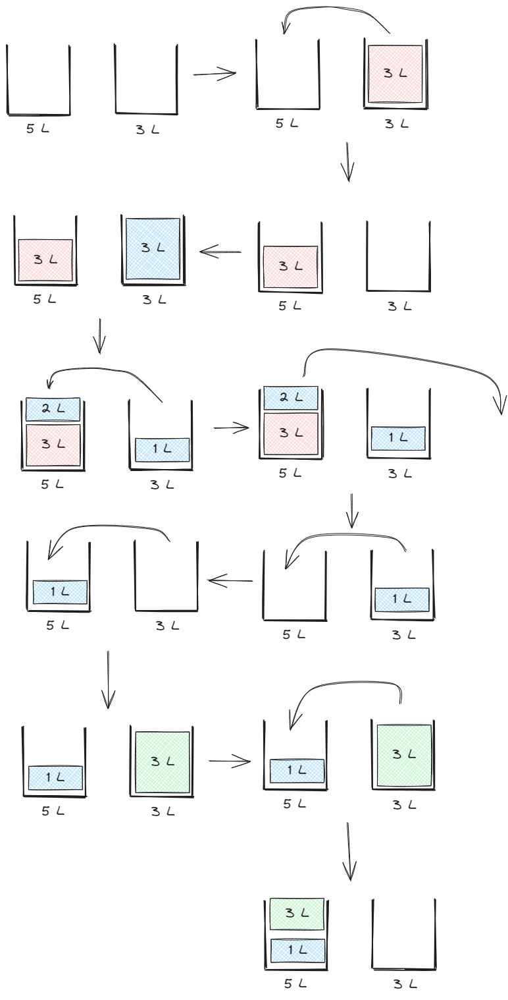

# Steps :
    1. Fill the 3L tank to its maximum capacity.
    2. Transfer the water from the 3L tank into the 5L tank.
    3. At this point, the 5L tank contains 3L of water.
    4. Refill the 3L tank to its maximum capacity.
    5. Pour water from the 3L tank into the 5L tank until the 5L tank is full. Now, the 5L tank contains 5L of water and the 3L tank has 1L of water remaining.
    6. Empty the 5L tank completely, so it contains 0L of water.
    7. Transfer the remaining 1L of water from the 3L tank into the 5L tank.
    8. Refill the 3L tank to its maximum capacity again.
    9. Pour water from the 3L tank into the 5L tank. Now, the 5L tank contains exactly 4L of water.
